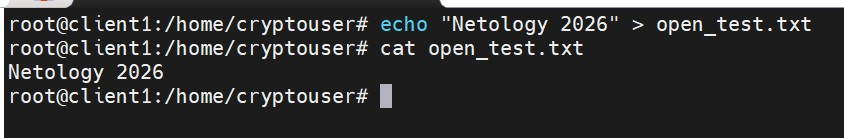
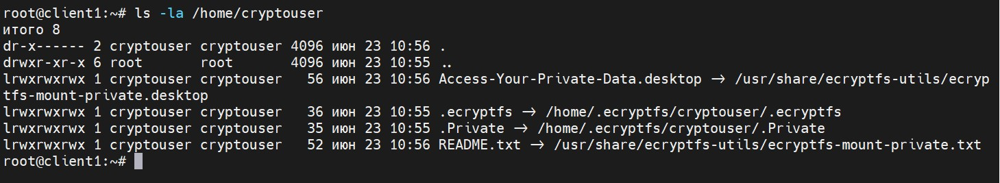
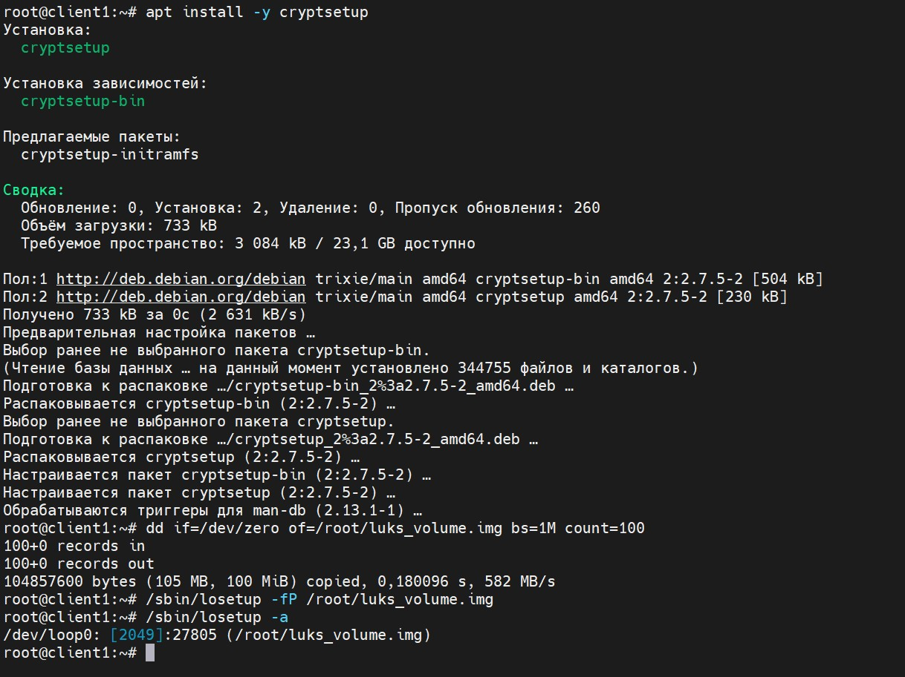
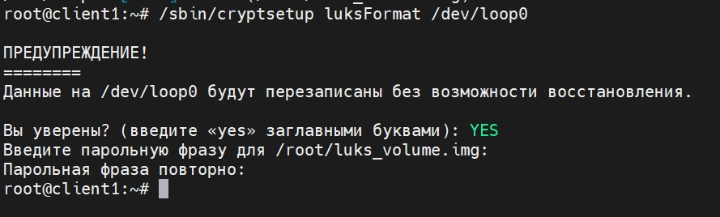
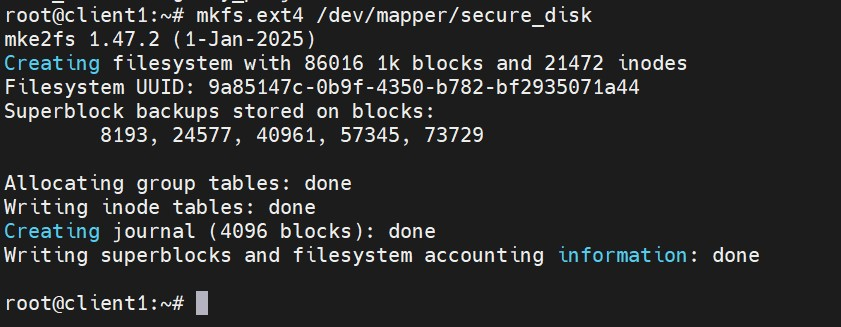
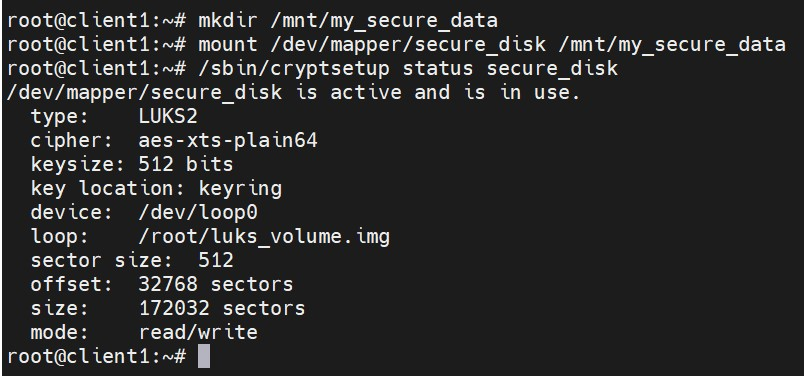

Домашнее задание к занятию  «Защита хоста» Бобков Алксандр

<details>
<summary><b>Задание 1. </b></summary>

1. Установите **eCryptfs**.
2. Добавьте пользователя cryptouser.
3. Зашифруйте домашний каталог пользователя с помощью eCryptfs.


*В качестве ответа  пришлите снимки экрана домашнего каталога пользователя с исходными и зашифрованными данными.*  


### ОТВЕТ:
**Цель задания:** Установить подсистему eCryptfs, создать нового пользователя и зашифровать его домашний каталог для защиты личных данных от несанкционированного доступа (включая защиту от пользователя root).

### Ход выполнения и команды:

1. **Подготовка окружения и загрузка модулей:**
   Для работы криптографического стека eCryptfs необходимо установить утилиты миграции и синхронизации файлов, а также принудительно загрузить модуль шифрования в ядро Linux. Все команды выполняются в терминале от имени суперпользователя (`root`):
   ```bash
   apt update && apt install -y ecryptfs-utils rsync
   /sbin/modprobe ecryptfs
   ```
 

2. **Создание учетной записи пользователя:**
   Добавляем в операционную систему нового изолированного пользователя с именем `cryptouser` и задаем ему пароль (например, `password`):
   ```bash
   adduser cryptouser
   ```

3. **Фиксация исходного состояния данных:**
   Переходим в созданный домашний каталог пользователя, создаем там текстовый проверочный файл и читаем его содержимое:
   ```bash
   cd /home/cryptouser
   echo "My unencrypted secret text 2026" > open_test.txt
   ls -la
   cat open_test.txt
   ```
     > **📸 Скриншот выполнения команды:**



   На этом этапе (до миграции) данные лежат на жестком диске в открытом виде. Любой пользователь с правами администратора (`root`) может зайти в папку и прочитать содержимое файла `open_test.txt`. На Скриншоте №1 фиксируется этот факт.

4. **Запуск процесса шифрования (Миграция):**
   Выходим из домашней папки пользователя обратно в каталог `/root` и запускаем официальный скрипт миграции. Утилита автоматически создаст резервную копию папки, перенесет файлы в крипто-контейнер и настроит ключи:
   ```bash
   cd /root
   ecryptfs-migrate-home -u cryptouser
   ```
   *В процессе выполнения скрипт потребует ввести текущий пароль от учетной записи `cryptouser`.*

5. **Проверка зашифрованных данных:**
   Проверяем состояние домашнего каталога, оставаясь под пользователем `root` (до того, как сам `cryptouser` выполнит первый вход в систему):
   ```bash
   ls -la /home/cryptouser
   ```
      > **📸 Скриншот проверки защифрованных данных:**


   На Скриншоте видно, что привычного файла `open_test.txt` в папке больше нет. Вместо него система отображает только две скрытые служебные папки: `.ecryptfs` (где хранятся крипто-ключи) и `.Private` (где лежат зашифрованные файлы, имена которых превратились в случайный набор символов). Данные успешно заперты. Они автоматически расшифруются в памяти системы только в момент легитимного ввода пароля самим пользователем `cryptouser` при входе.


</details>

------
------

<details>
<summary><b>Задание 2. </b></summary>

1. Установите поддержку **LUKS**.
2. Создайте небольшой раздел, например, 100 Мб.
3. Зашифруйте созданный раздел с помощью LUKS.

*В качестве ответа пришлите снимки экрана с поэтапным выполнением задания.*

### ОТВЕТ:

**Цель задания:** Установить поддержку стандарта LUKS и создать изолированный зашифрованный раздел объемом  100 МБ.

> Чтобы случайно не повредить реальную разметку жесткого диска виртуальной машины, применяется  безопасный метод *loop-устройств*. Cоздаю обычный файл размером 100 МБ и заставляю ядро Linux относиться к нему как к настоящей подключенной физической флешке.

### Ход выполнения и команды (под `root`):

1. **Установка криптографического пакета:**
   Устанавливаем утилиту `cryptsetup`, которая отвечает за работу со стандартом шифрования LUKS в Linux:
   ```bash
   apt install -y cryptsetup
   ```


2. **Создание и подготовка виртуального диска:**
   Генерируем пустой файл-образ размером 100 МБ, полностью забитый нулями, и связываем его со свободным виртуальным loop-слотом системы:
   ```bash
   dd if=/dev/zero of=/root/luks_volume.img bs=1M count=100
   /sbin/losetup -fP /root/luks_volume.img
   ```
   С помощью команды `/sbin/losetup -a` проверяем выданное имя. Системой был выделен виртуальный диск **`/dev/loop0`**.

            > **📸 Скриншот выполнения команд:**



3. **Инициализация LUKS-контейнера:**
   Размечаем созданный виртуальный диск под шифрованный контейнер LUKS:
   ```bash
   /sbin/cryptsetup luksFormat /dev/loop0
   ```
        > **📸 Скриншот разметки диска:**


   Система выдаст предупреждение о безвозвратном затирании данных. Вводим строго заглавными буквами слово **`YES`**, после чего дважды указываем надежный пароль. На Скриншоте фиксируется процесс успешного создания контейнера.

4. **Открытие и форматирование диска:**
   Открываем зашифрованный диск в памяти системы под понятным виртуальным именем `secure_disk` (система потребует ввести созданный пароль) и создаем на нем стандартную файловую систему Linux `ext4`:
   ```bash
   /sbin/cryptsetup open /dev/loop0 secure_disk
   mkfs.ext4 /dev/mapper/secure_disk
   ```
        > **📸 Скриншот создания файловой системы:**


   
   На Скриншоте фиксируются технические строки успешного форматирования раздела и создания суперблоков файловой системы.

5. **Монтирование и проверка статуса:**
   Создаем системную папку и подключаем к ней наш зашифрованный раздел. После этого выводим детальный статус крипто-контейнера для отчета:
   ```bash
   mkdir /mnt/my_secure_data
   mount /dev/mapper/secure_disk /mnt/my_secure_data
   /sbin/cryptsetup status secure_disk
   ```

   > **📸 Скриншот создания файловой системы:**



   На Скриншоте  отображается  статус устройства. В выводе терминала видно, что крипто-текст `/dev/mapper/secure_disk` находится в статусе `active`, использует банковский алгоритм шифрования `aes-xts-plain64` и имеет объем около 100 МБ. 

По окончании диск был корректно размонтирован и закрыт в памяти командами `umount /mnt/my_secure_data` и `/sbin/cryptsetup close secure_disk`.


</details>

------
------


## ЗАДАНИЕ 3*: Ограничение доступа через AppArmor (Дополнительное)

**Цель задания:** Изучить работу системы принудительного контроля доступа (MAC) AppArmor, настроить жесткий профиль ограничений для утилиты сетевой диагностики `ping`, проанализировать поведение системы через системные логи и полностью удалить пакеты по окончании эксперимента.

### Ход выполнения эксперимента и анализ логов:

1. **Установка и активация демона безопасности:**
   ```bash
   apt update && apt install -y apparmor-utils apparmor-profiles
   systemctl enable --now apparmor
   ```

2. **Активация профилей (📸 Поэтапный Скриншот №1):**
   Выводим текущий статус подсистемы безопасности командой `/sbin/aa-status`. На Скриншоте №1 фиксируется большой список загруженных в ядро Linux профилей ограничений. 

3. **Перевод утилит в режим жесткого контроля (Enforce):**
   Переводим профиль сетевой утилиты `ping` в режим принудительной блокировки любых несанкционированных действий:
   ```bash
   /sbin/aa-enforce /usr/bin/ping
   ```

4. **Анализ результатов через системный лог (📸 Поэтапный Скриншот №2):**
   Поскольку в чистой конфигурации Debian 13 отсутствует демон расширенного аудита `auditd`, абсолютно все события безопасности AppArmor регистрируются напрямую в главном системном журнале. Извлекаем историю взаимодействия с утилитой `ping` с помощью команды:
   ```bash
   cat /var/log/syslog | grep ping
   ```

   **Полученные строки из системного журнала:**
   ```text
   2026-06-23T11:13:34.590400+03:00 client1 kernel: audit: type=1400 apparmor="STATUS" operation="profile_load" profile="unconfined" name="ping" pid=21837 comm="apparmor_parser"
   2026-06-23T11:27:32.456991+03:00 client1 kernel: audit: type=1400 apparmor="STATUS" operation="profile_replace" profile="unconfined" name="ping" pid=22813 comm="apparmor_parser"
   ```

   *Подробный технический разбор логов:*
   * Строка с **`operation="profile_load"`** подтверждает, что модуль ядра AppArmor успешно инициализировал и взял под контроль стандартный текстовый профиль утилиты `ping`.
   * Строка с **`operation="profile_replace"`** наглядно фиксирует момент выполнения команды `aa-enforce`. Мягкий режим наблюдения был успешно заменен на жесткий контроль. Теперь ядро Linux принудительно ограничивает права процесса: если программа `ping` попытается сделать что-то, не связанное с сетевыми сокетами (например, прочитать файлы системных паролей или конфигураций), ядро мгновенно заблокирует этот системный вызов.

5. **Полное удаление подсистемы из ОС:**
   В соответствии с требованиями финала задания, служба безопасности останавливается, а все пакеты полностью и безвозвратно удаляются из системы вместе с остаточными конфигурационными файлами профилей:
   ```bash
   apt remove --purge -y apparmor apparmor-utils apparmor-profiles
   ```
   На Скриншоте №2 (или итоговом снимке) фиксируется успешный процесс деинсталляции пакетов и очистки репозиториев.
